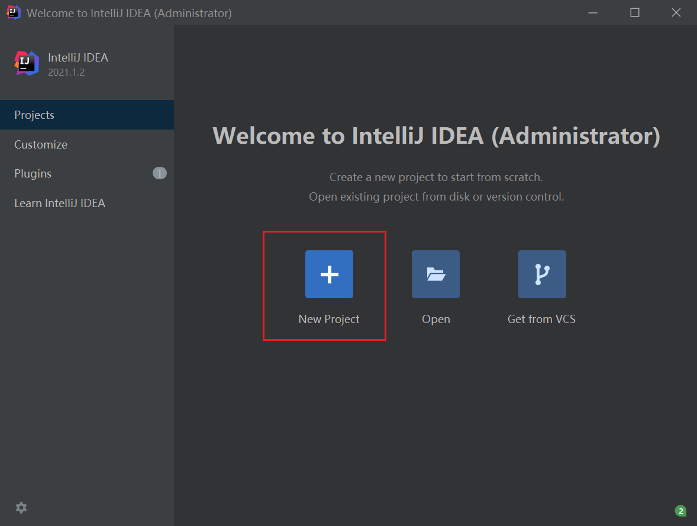
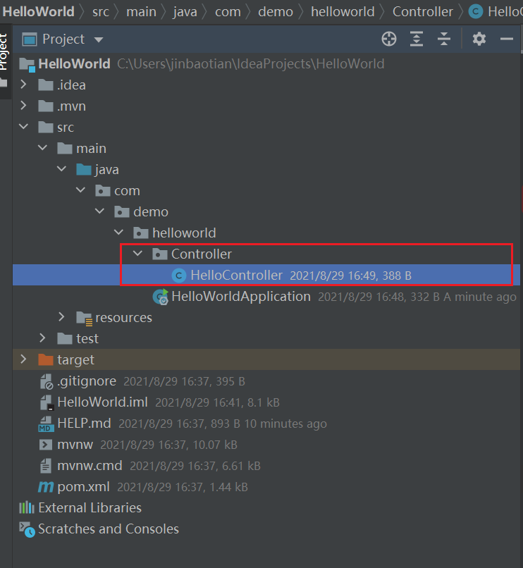

# SpringWeb开发环境搭建文档(windows版)


## 1、JDK下载安装及环境变量配置

### 1.1 JDK简介

JDK(Java SE Development kit Java开发工具包)，即java标准版开发包，是Oracle提供的一套用于开发java应用程序的开发包，它提供编译，运行java程序所需要的各种工具和资源，包括java编译器，java运行时环境，以及常用的java类库等。

### 1.2 JDK下载

点击[下载地址](https://www.oracle.com/java/technologies/javase-downloads.html)，根据系统的版本下载相对应的JDK


### 1.3 安装JDK&配置环境变量

下载好JDK，根据安装指引安装到自己所需路径即可。接下来开始配置**环境变量**

1、右键我的电脑——属性——高级系统设置，进入如下界面，选择环境变量


​																												              【环境变量】


2、点击**系统变量**下的新建按钮，变量名JAVA_HOME（代表你的JDK安装路径），值是你的JDK安装路径。


​																												【新建系统变量JAV_HOME 】

3、然后在系统变量中继续新建一个CLASSPASH变量，值为

```shell
 .;%JAVA_HOME%\lib\dt.jar;%JAVA_HOME%\lib\tools.jar;
```


​                                                                                                          【新建系统变量CLASS_PATH 】

4、在你的系统变量里面找一个变量名是PATH的变量，需要在它的值域里面追加一段如下的代码

```
%JAVA_HOME%\bin;%JAVA_HOME%\jre\bin;
```


5、测试环境变量是否正确配置，WINDOWS+R,输入cmd打开命令行界面，输入 java -version，可以查看自己所装JDK版本，如果如下图所示，则表示安装正确。


## 2、IDEA下载安装及使用

IDEA 在业界被公认为最好的Java开发工具之一，接下来我们安装IDEA

### 2.1 下载IDEA

点击[下载地址](https://www.jetbrains.com/zh-cn/idea/download/)选择Ultimate版本


​																							【下载IDEA】

### 2.2 安装IDEA


## 3、maven下载安装及使用

maven是 Apache软件基金会组织维护的一款自动化 构建工具，专注服务于 Java 平台的项目构建 ，帮助开发者进行**项目构建和依赖管理**

### 3.1 maven下载

1、点击[下载链接]([Maven – Download Apache Maven](https://maven.apache.org/download.cgi))，选择左侧Download


2、点击如下链接进行下载


### 3.2 maven安装及环境变量配置

1、下载完成后，选择一个位置进行解压即可，然后按照上述创建JAVA_HOME的方式创建MAVEN_HOME,值为maven解压的路径

2、在path中追加如下内容

```
%MAVEN_HOME%\bin
```

3、WINDOWS+R，输入cmd，打开命令行，输入mvn -version ，如图所示则成功


## 4、hello-world-web-demo

到此为止，我们已经完成了所有的环境准备，接下来写一个简单的hello-world测试一下。

### 4.1 创建一个SpringBoot项目



选择 Spring Initializr->选择sdk以及default 更改Group,Artifact,java Version,package


选择SpringBoot版本->起步依赖选择Spring Web


### 4.2 hello world小程序

右键helloworld文件夹下创建一个Controller包，并在Controller包中创建一个HelloController 类如下



输入如下代码

```java
package com.demo.helloworld.Controller;

import org.springframework.web.bind.annotation.RequestMapping;
import org.springframework.web.bind.annotation.RestController;

@RestController
public class HelloController {

    @RequestMapping("/hello")
    public String test(){
        return "Hello World!";
    }

}

```

### 4.3 启动服务

右键HelloWorldApplication主类并启动


控制台看到如下输出，服务成功启动


打开浏览器，输入 http://localhost:8080/hello，看到如下结果，试验成功。

